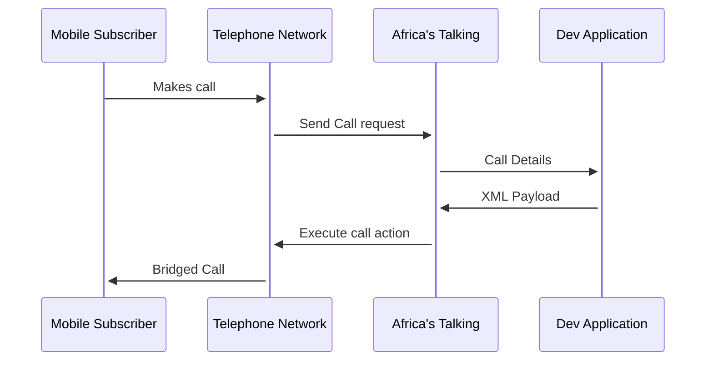
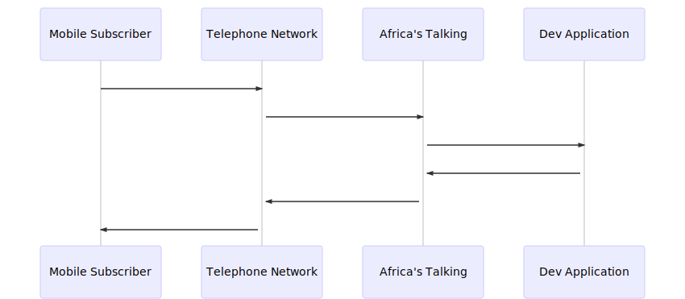

# Yoda Voice Introductory Course

## Intro

In this section we're going to create a simple application that responds to an inbound call by either playing a media file or saying a phrase.

The call details will be POST'ed to the application callback and the application will respond with the correct XML response.

The call-flow will be as follows:

Running this application 

- Install Docker : [How to](https://docs.docker.com/install/)
- Install Docker-compose: [How to](https://docs.docker.com/compose/install/)
- Run `docker-compose up -d` 
- Profit